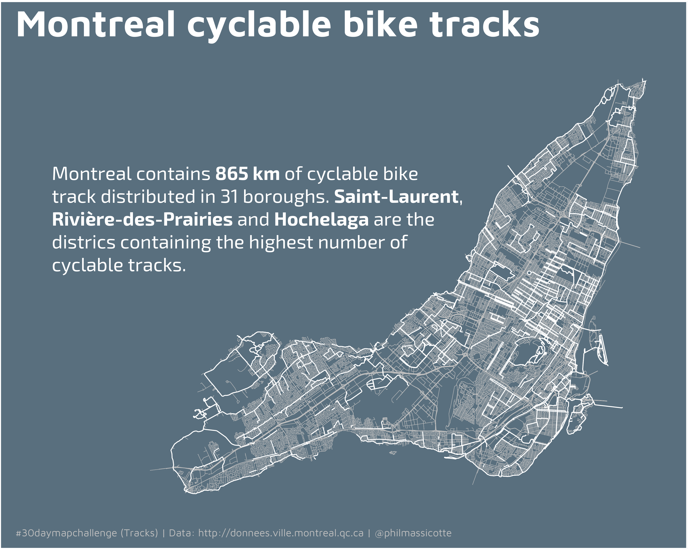
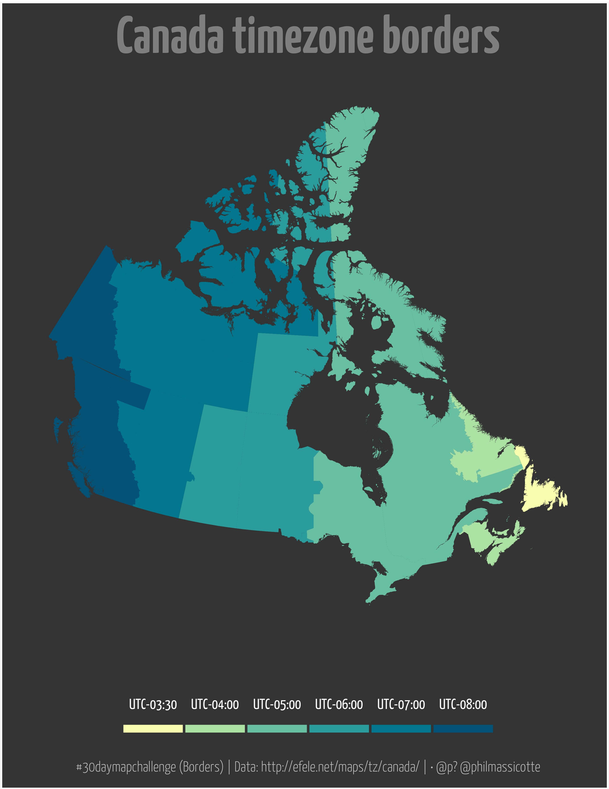
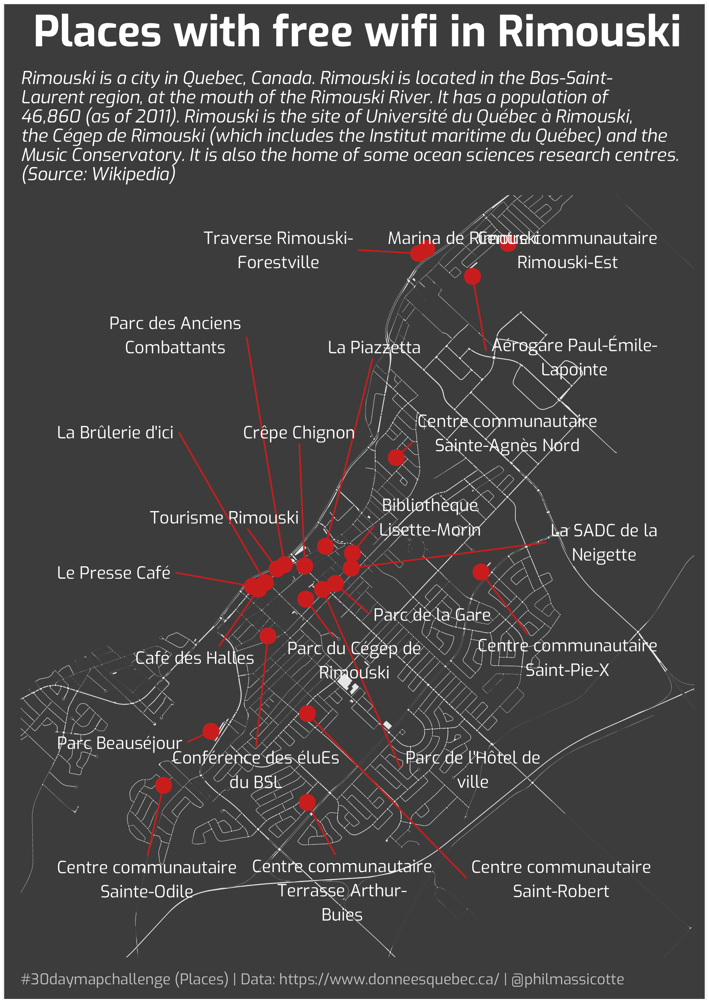
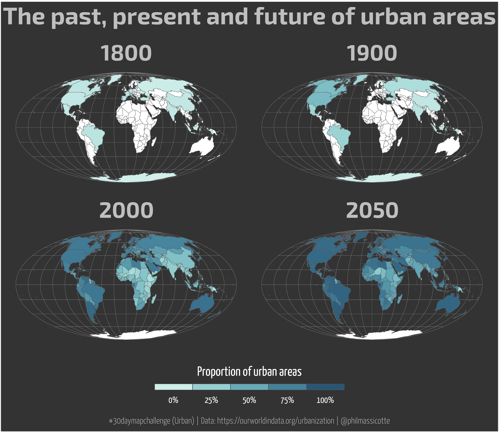
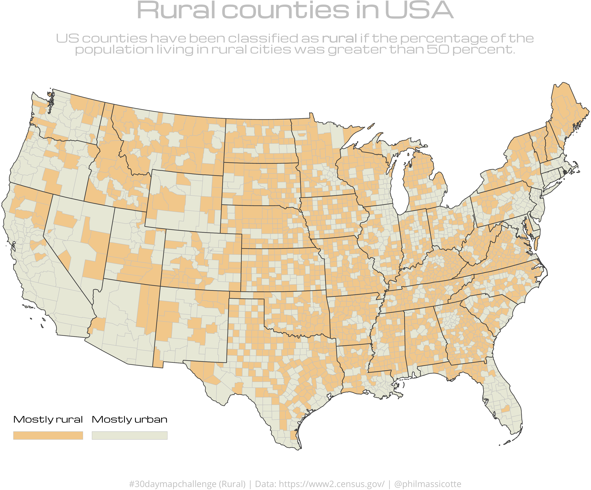
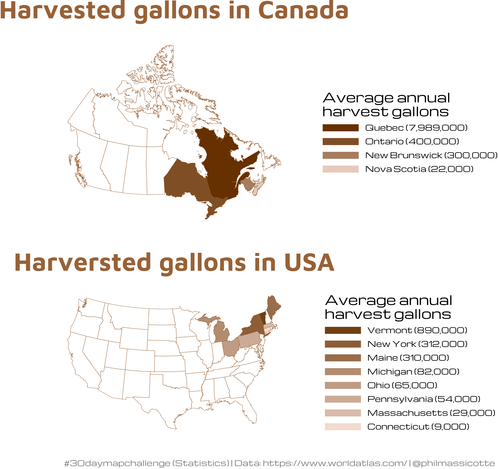
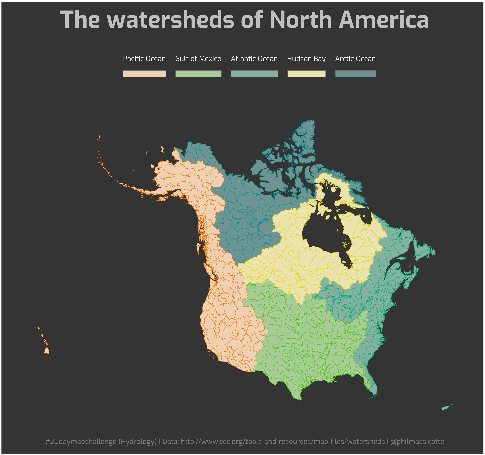
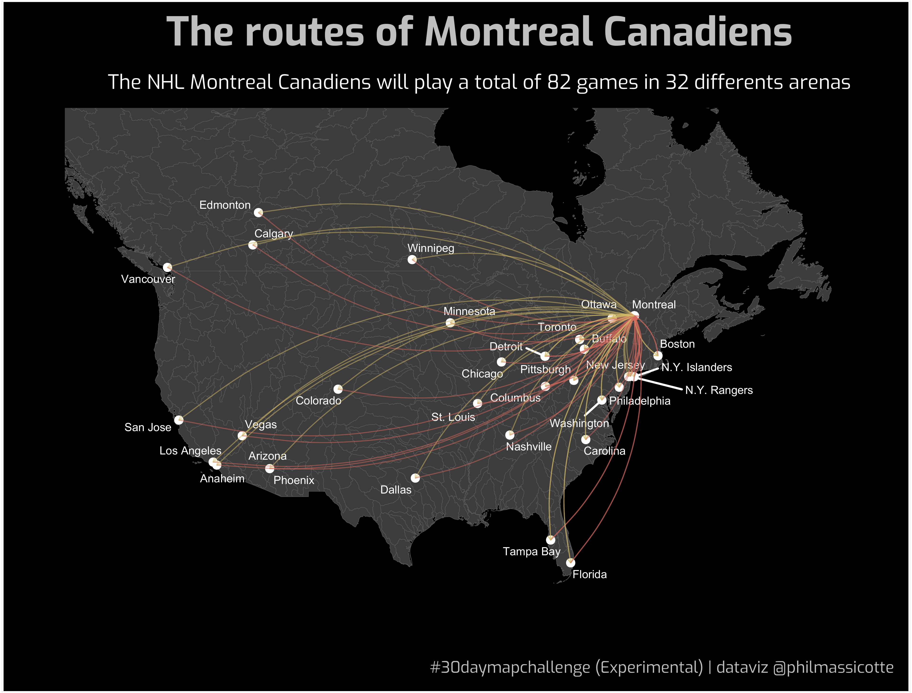

# 30DayMapChallenge

My contributions to the [30DayMapChallenge](https://twitter.com/hashtag/30daymapchallenge?lang=en).

## Day 1 (Points)

## Day 10 (Black & White)

## Day 11 (Elevation)

## Day 12 (Movement)

## Day 13 (Tracks)

## Day 14 (Borders)

## Day 16 (Places)

## Day 17 (Zones)

## Day 19 (Urban)

## Day 20 (Rural)

## Day 24 (Statistics)

## Day 26 (Hydrology)

## Day 27 (Resources)

## Day 29 (Experimental)

## Day 30 (Home)

